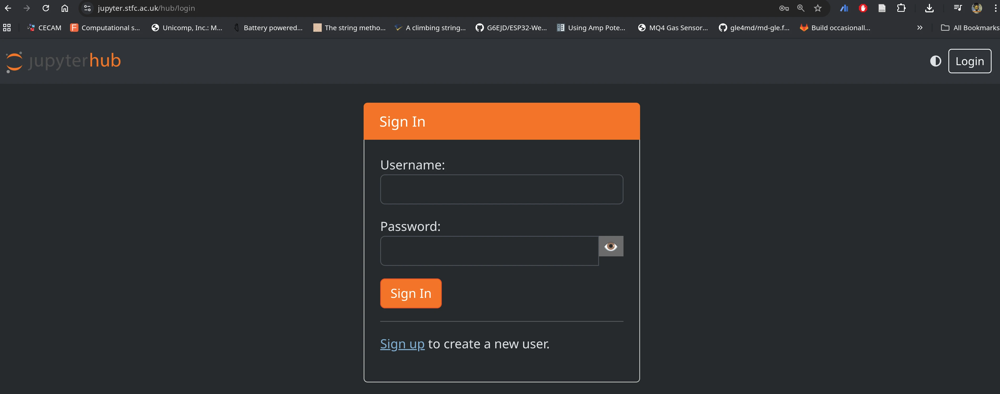
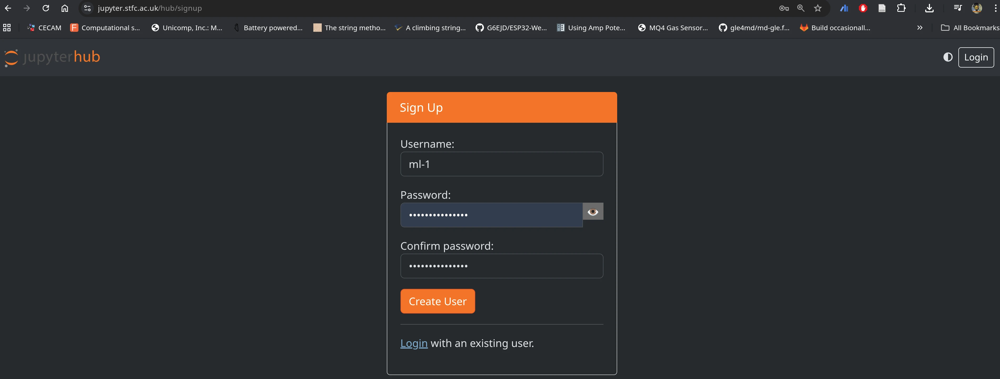
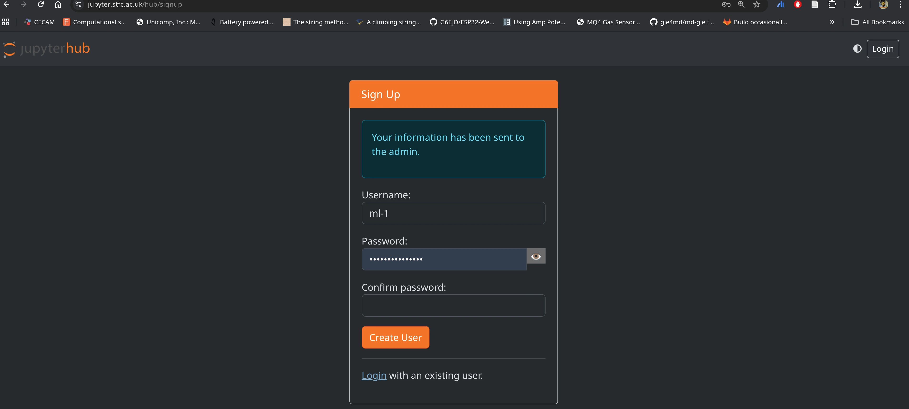
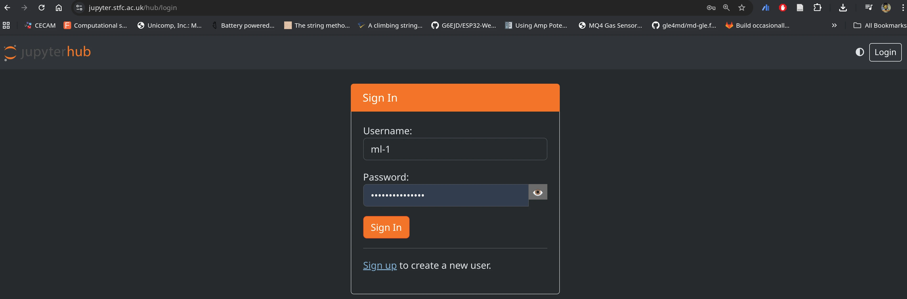
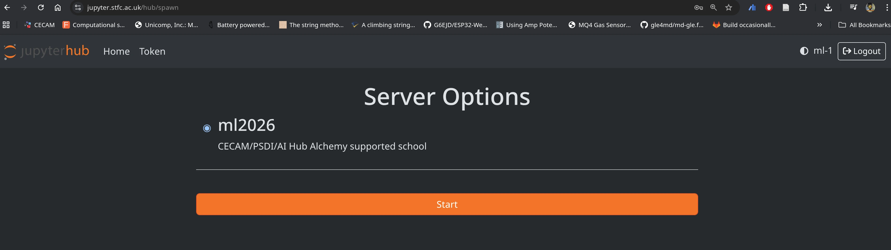
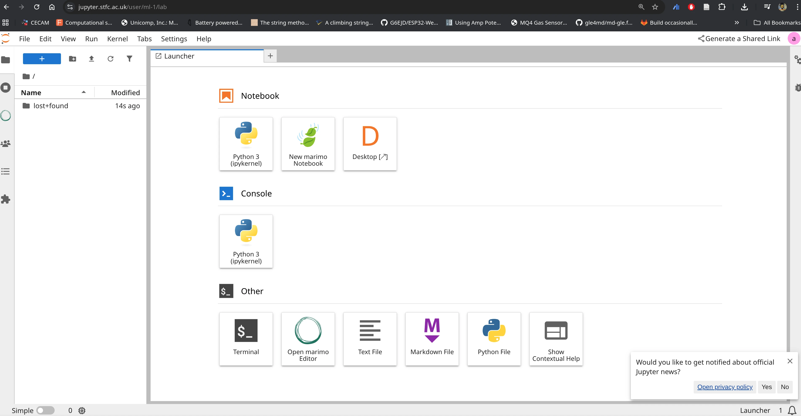
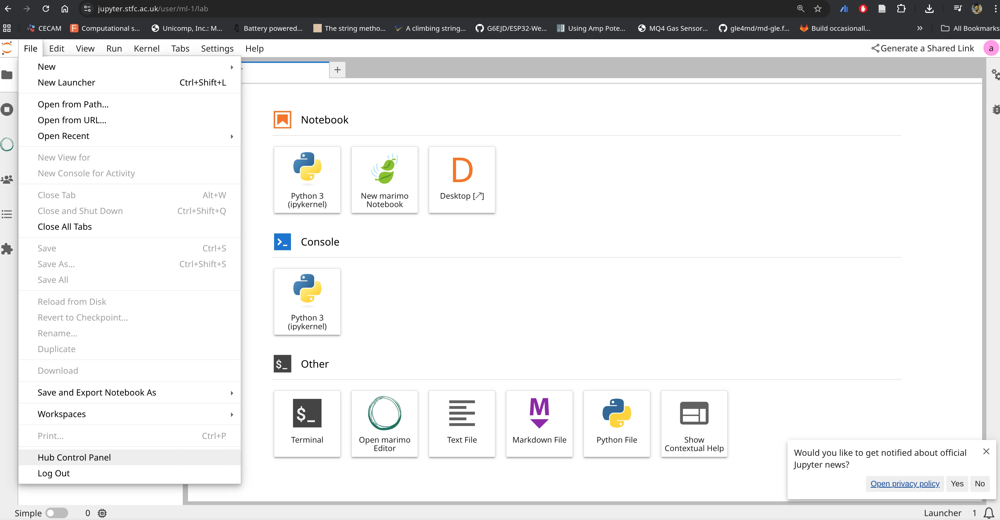
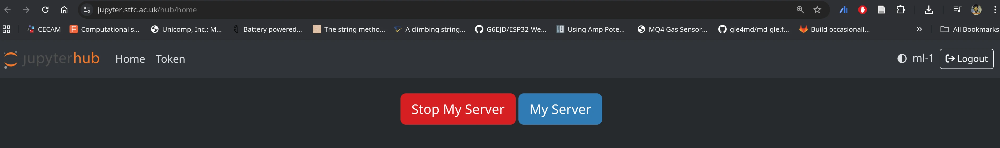

# Introduction to Work Environment

## Access the cloud

We will use STFC cloud environment
<https://jupyter.stfc.ac.uk>. It runs a custom baked docker
image of Ubuntu Noble Numbat

Use the username given at registration and following instructions to
setup your instance.

### Create account and login

1.  Go to jupyter.stfc.ac.uk DO NOT CLICK on sign in!

   

2.  Signup: click on **Signup** then use the username given and choose
    password and click **Create User**

   

Authorization happens behind the scenes if successful you will see
something like.



1.  Login with the credentials from above


   

You shall see something like this, if all ok,



or instance already started. see below.

### Create instance

In the list you shall see ml2026, select it and click start.

Once you click start will spawn the new VM machine, shall take 2 min or
so but sometimes can be faster or slower, which exists for 24h by
default and has a persistent home directory associated with your user.


   

### Stop instance and update

if things go wrong or you need to create an instance with an updated
image you need to follow the following steps.

1.  get the hub settings: File -\> Hub Control Panel

   

2.  stop the instance

    stop the instance by clicking on the "Stop My Server" button then
    once stopped you can click Logout.

   


3.  logout and create a new instance as above. This will use the latest
    version of the image.


## Obtain exercises

open a terminal

``` bash
cd
git clone https://gitlab.com/cam-ml/tutorials.git WORKSHOP
```

a WORKSHOP folder will appear on the left hand side and now you can
navigate inside it and find the relevant notebook of the day.

## Useful commands

as tutorials get updated or corrected during the school you may need to pull again,
solution or corrections. To do this in general you do

```bash
# be sure you are in the right folder
cd ~/WORKSHOP
git pull
```
if you have local changes, you may want to use

```bash
git stash
```

to save your changes, after this you can do **git pull**

after you can restore your changes with

```bash
git stash apply
```

## Compilers

The **GNU** toolchain is used throughout the summer school and are
available at the unix prompt.

-   **gcc**: the C/C++ compiler
-   **gfortran**: the fortran compiler (it assumes f77 and f95 for `*`.f
    and `*`.f90 respecively). Some of the codes may be in fixed format
    requiring the compiler flag -ffixed-form.
-   **python3** is available on the machine, use python3, be aware that
    python will give you python2.

There are several editors available. You should choose whichever you are
confortable with.

-   **vi** the venerable UNIX screen mode editor.
-   **vim** the improved venerable UNIX screen mode editor.
-   **emacs** probably the commonest full-screen UNIX editor.


## Advanced: run locally with docker/podman

Both [Docker](https://www.docker.com/) and
[podman](https://www.podman.io/) shall work. We will use podman in these
instructions.

1.  install podman

    Follow the [instructions for your operating
    system.](https://podman.io) Depending on your OS this may be simpler
    or more difficult we suggest you do this prior to school.

    For Linux your package manager probably already has podman.

    For Windows and MacOS choose *podman CLI*\* and install. For windows
    install [wsl2
    before](https://learn.microsoft.com/en-us/windows/wsl/install) be
    sure you set version 2.

    For windows and MacOS start the machines by starting a shell,
    Windows Powershell in windows any terminal in mac.

``` bash
# only windows and MacOs
podman machine init
podman machine start
```

2.  create a folder to share with the machine(optional)

    > this folder can be sure to get data from the jupyterhub on your
    > local harddrive after you shut it down. Be careful that is not
    > writable to a normal user on your machine, only root on Linux.

``` bash
mkdir work
# next command is only on linux
podman unshare chown 1001:100 work
```

3.  start the container

    Execute the command in a terminal.

    > **note** if you choose not to have a folder in the previous step
    > remove **-v ./work:/home/jovyan/work:Z** below

``` bash
podman run --rm --security-opt seccomp=unconfined -p 8888:8888 -v ./work:/home/jovyan/work:Z harbor.stfc.ac.uk/ccp5/ml2026:latest
```

if you see this error, especially on MAC OSX

``` bash
Trying to pull harbor.stfc.ac.uk/ccp5/ml2026:latest...
Error: internal error: unable to copy from source docker://harbor.stfc.ac.uk/ccp5/ml2026:latest: choosing an image from manifest list docker://harbor.stfc.ac.uk/ccp5/ml2026:latest: no image found in image index for architecture "arm64", variant "v8", OS “linux"
```

``` bash
podman run --rm --security-opt seccomp=unconfined -p 8888:8888 --platform linux/amd64  -v ./work:/home/jovyan/work:Z harbor.stfc.ac.uk/ccp5/ml2026:latest
```

4.  get into the container

    At this stage you should have a running jupyter hub, all you need is
    to start it in your browser. You shall see various debug lines in
    your terminal, localte **Or copy and paste one of these URLs:** part
    and click on one of them.

> start container

6.  if all is ok you shall see


7.  click on Desktop tile to get access to a traditional environment


8.  close the container

    Ctrl+C in terminal will do it.

9.  keep the image up to date

``` bash
podman pull harbor.stfc.ac.uk/ccp5/ml2026:latest
```

10. [optional] If you have an NVIDIA GPU and you want to use, check the instructions here
     https://podman-desktop.io/docs/podman/gpu

**Note** you can change the theme by going to Settings-\>Theme-\>

## Obtain exercises

open a terminal, clik on the Terminal tile.

``` bash
cd
# or if you setup the work folder above, uncommend bellow
#cd work
git clone https://gitlab.com/cam-ml/tutorials.git WORKSHOP
```

a WORKSHOP folder will appear on the left hand side and now you can
navigate inside it and find the relevant notebook of the day.

> checkout WORKSHOP


## Using Google Colab

Run using [Google Colab](https://colab.research.google.com/)

1.  Get a google account if you do not have one.

    Navigate to the desired tutorial on \[tutorials
    website\](https://workshop.camml.ac.uk/) and click the
    
    badge.

<!-- -->

2.  be sure you execute the Google colab specific section of each tutorial, shall be one.

**Note**: google colab instances are not persistent so you may want to
save your work in google drive or download it on your machine.
