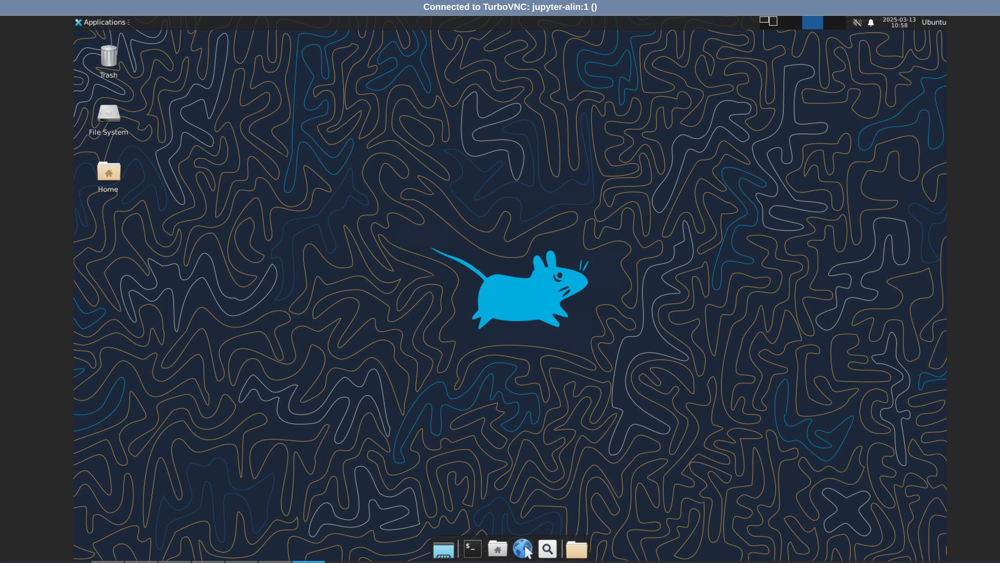

# Introduction to Work Environment

## Access the cloud

We will use STFC cloud environment
<https://training.jupyter.stfc.ac.uk>. It runs a custom baked docker
image of Ubuntu Noble Numbat

Use the username given at registration and following instructions to
setup your instance.

### Create account and login

1.  Go to training.jupyter.stfc.ac.uk DO NOT CLICK on sign in!

   

2.  Signup: click on **Signup** then use the username given and choose
    password and click **Create User**

   

Authorization happens behind the scenes if successful you will see
something like.


1.  Login with the credentials from above


   

You shall see something like this, if all ok,


or instance already started. see below.

### Create instance

In the list you shall see ML 2025, select it and click start.

Once you click start will spawn the new VM machine, shall take 2 min or
so but sometimes can be faster or slower, which exists for 24h by
default and has a persistent home directory associated with your user.


   

If you click desktop you will get a minimalistic desktop environment

   

you can see a video of [the process](https://youtu.be/0D6qKeVWuYk)

### Stop instance and update

if things go wrong or you need to create an instance with an updated
image you need to follow the following steps.

1.  get the hub settings: File -\> Hub Control Panel

   

2.  stop the instance

    stop the instance by clicking on the "Stop My Server" button then
    once stopped you can click Logout.

   


3.  logout and create a new instance as above. This will use the latest
    version of the image.

[a video of the process](https://youtu.be/R0rEl9DbG3k)


## Obtain exercises

open a terminal

``` bash
cd
git clone https://gitlab.com/cam-ml/camml.git WORKSHOP
```

a WORKSHOP folder will appear on the left hand side and now you can
navigate inside it and find the relevant notebook of the day.

> checkout WORKSHOP

## Browsers

**Mozilla Firefox** is installed on the machine.

## Compilers

The **GNU** toolchain is used throughout the summer school and are
available at the unix prompt.

-   **gcc**: the C/C++ compiler
-   **gfortran**: the fortran compiler (it assumes f77 and f95 for `*`.f
    and `*`.f90 respecively). Some of the codes may be in fixed format
    requiring the compiler flag -ffixed-form.
-   **python3** is available on the machine, use python3, be aware that
    python will give you python2.

## Molecular Graphics Packages

**VMD**, **VESTA** and **Ovito** are the basic viewers for use in the summer school.

## Editors

There are several editors available. You should choose whichever you are
confortable with.

-   **vi** the venerable UNIX screen mode editor.
-   **vim** the improved venerable UNIX screen mode editor.
-   **emacs** probably the commonest full-screen UNIX editor.
-   **gedit** gui editor

## Terminals

When one refers to terminal, console or command line, usually means a
shell window. Gnome Terminal, xterm and uxterm are available, You can
click on the terminal icon to get one in the desktop or in the jupyter
hub.


## Advanced: running docker tutorial.

You can use docker compose to run the environment locally on your machine

Save the following block as ml2025.yaml

```yaml
version: '2.1'
services:
  my_cont:
    image: harbor.stfc.ac.uk/ccp5/ml2025:latest
    container_name: ml2025
    network_mode: host
    restart: always
    security_opt:
      - seccomp:unconfined
    ports:
      - 5901:5901
      - 5801:5801
      - 403:403
    volumes:
      - /home/drFaustroll/playground/ml/:/opt/ccp5
    environment:
      - TZ=Europe/London
    logging:
      driver: "json-file"
      options:
        max-size: "50m"
```

now you can start the environment with

```bash
  docker compose -f ml2025.yaml up
```


you shall see a lot of output with something like this towards the end

```bash
ml2025  |     To access the server, open this file in a browser:
ml2025  |         file:///home/jovyan/.local/share/jupyter/runtime/jpserver-7-open.html
ml2025  |     Or copy and paste one of these URLs:
ml2025  |         http://belial:8888/lab?token=fd99b305dbd4744f14c7fa6ad14f85435c8e861b8f330c96
ml2025  |         http://127.0.0.1:8888/lab?token=fd99b305dbd4744f14c7fa6ad14f85435c8e861b8f330c96
ml2025  | [I 2025-03-13 10:39:37.066 ServerApp] Skipped non-installed server(s): bash-language-server, dockerfile-language-server-nodejs, javascript-typescript-langserver, jedi-language-server, julia-language-server, pyright, python-language-server, python-lsp-server, r-languageserver, sql-language-server, texlab, typescript-language-server, unified-language-server, vscode-css-languageserver-bin, vscode-html-languageserver-bin, vscode-json-languageserver-bin, yaml-language-server

```

now you can access the hub in your browser. be aware, desktop in browser feature may work or not on your local setup.
